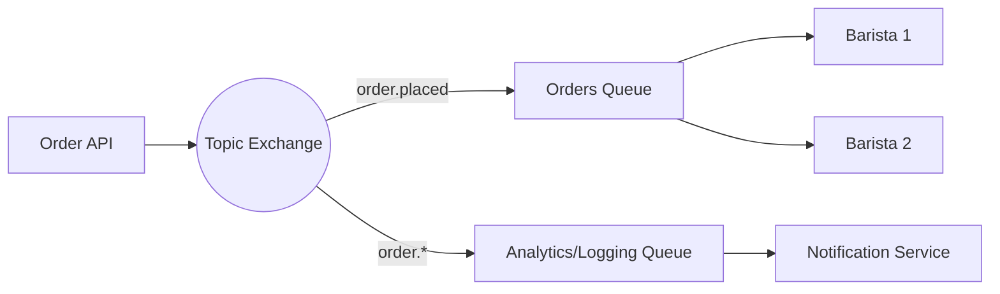

# 09 - Practice Project: The Distributed Coffee Shop

To solidify your RabbitMQ knowledge, you will build a simplified order processing system for a coffee shop.

---

## 1. Project Overview

We will simulate three components:
1.  **Order API**: Receives orders from customers and publishes them.
2.  **Barista Service**: Processes the coffee orders (Simulates work).
3.  **Customer Notification Service**: Notifies customers when orders are placed or completed.

---

## 2. Requirements

### Infrastructure
- Use a **Topic Exchange** named `coffee_shop_events`.
- Use **Durable Queues**.
- Use **Persistent Messages**.

### Features to Implement
1.  **Work Queues**: Multiple Baristas should be able to process orders from the same queue.
2.  **Pub/Sub**: When an order is placed, both the Barista and the Notification service should get information.
3.  **Reliability**: Use **Manual ACKs**. If a Barista "crashes" (you kill the process), the order should return to the queue.
4.  **Error Handling**: If an order is for "Alcohol" (unsupported), send it to a **Dead Letter Queue**.

---

## 3. Architecture Diagram



---

## 4. Implementation Steps

### Step 1: Setup RabbitMQ
Start RabbitMQ with the management plugin:
```bash
docker run -d --name rabbitmq -p 5672:5672 -p 15672:15672 rabbitmq:3-management
```

### Step 2: The Producer (Order API)
Create a script that:
- Connects to RabbitMQ.
- Declares a Topic Exchange: `coffee_shop_events`.
- Publishes a message with routing key `order.placed`.
- Message body: `{"id": 101, "item": "Latte", "customer": "Alice"}`.

### Step 3: The Barista (Work Queue)
Create a script that:
- Declares a queue: `barista_tasks` (Durable).
- Binds it to the exchange with routing key `order.placed`.
- Sets **Prefetch Count** to 1.
- Processes the message (adds a `sleep` of 5 seconds).
- Sends a **Manual ACK**.

### Step 4: The Dead Lettering
Modify the Barista:
- If the `item` is "Beer", send a **NACK** with `requeue: false`.
- Ensure the `barista_tasks` queue is configured with `x-dead-letter-exchange`.

---

## 5. Bonus Challenges (Expert Level)
- **Quorum Queues**: Migrate your `barista_tasks` queue to a Quorum Queue.
- **RPC**: Implement an "Inventory Check" where the Order API asks an Inventory Service if beans are available before placing the order.
- **Monitoring**: Open the Management UI and watch the "Spike" in message rates as you send 100 orders at once.

---

## Congratulations!
You have completed the RabbitMQ journey from Beginner to Expert. You now have the tools to build scalable, reliable, and decoupled distributed systems.
